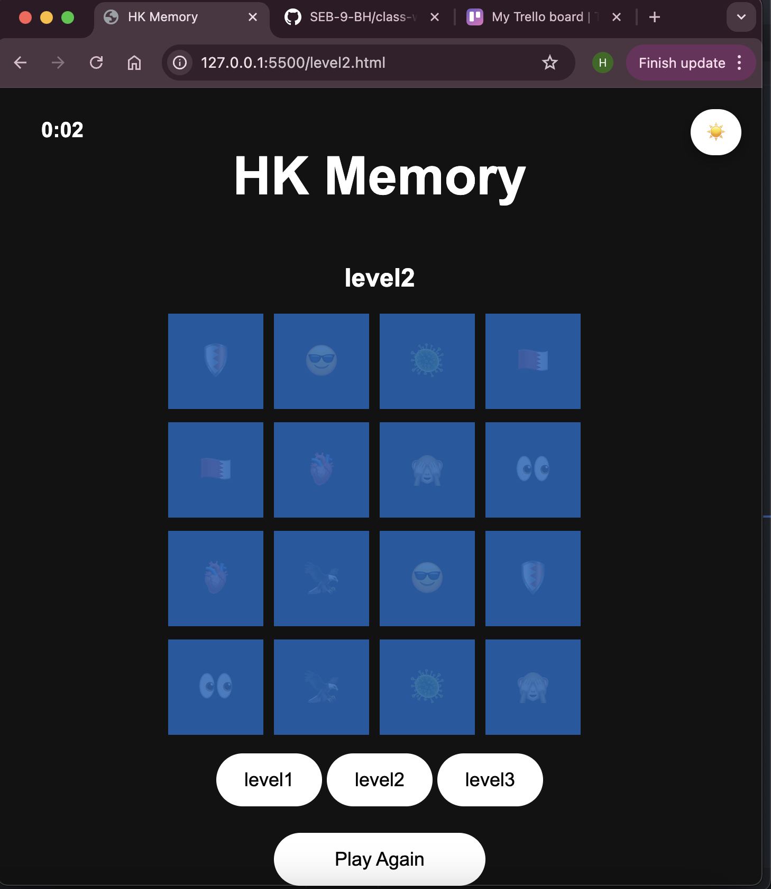

 #                                                HK memory 

**entertainment game the funny browser game**
## Description : 
**Hk memory game testing user memory by trying to search for pairs of emoji  if both cads have same emoji and so on until he find all 16 cards total**

**If the user clicks at any cards the will give him one second delay so user could recognize which emojis does shows so he could find same emoji as possible i have add more features likes added timer and 3 buttons that represent 3 levels for more challanges to compelete the game** 

#  Memory Card Game

**A straightforward, entertaining memory-matching game that runs in the browser and was created with HTML, CSS, and JavaScript. Using your memory, turn the cards over and try to locate every matching pair.**

## Overview

**Players must locate matching pairs among a deck of face-down cards in the Memory Card Game. The player**
## flips two cards every turn:

**The cards stay face-up if they match. If not, they wait a little while before flipping back.**

**When every pair is successfully matched, the game is over. For a tidy interactive experience, it makes use of card shuffling, fluid animations, and simple DOM manipulation.**

